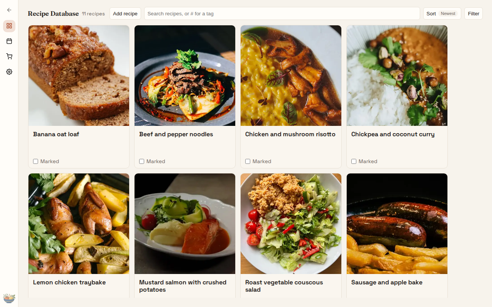
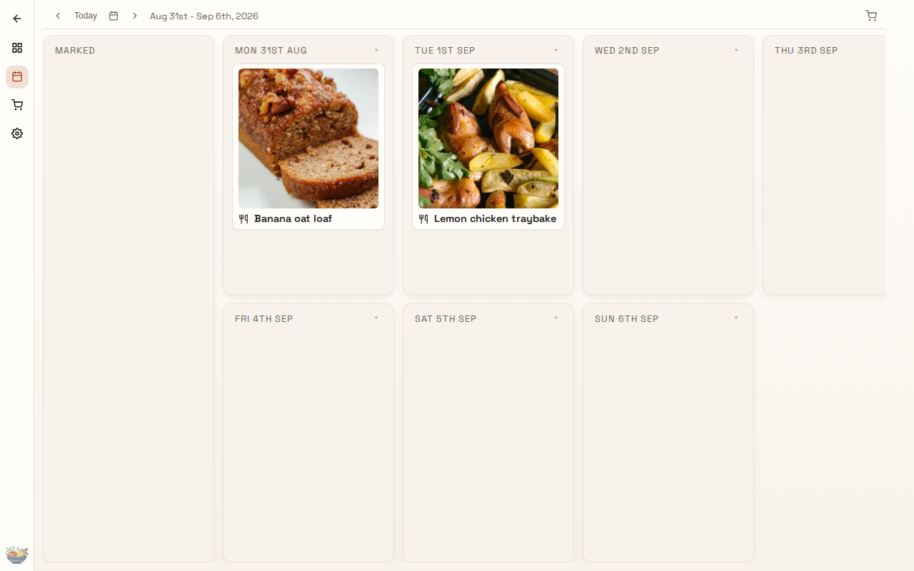
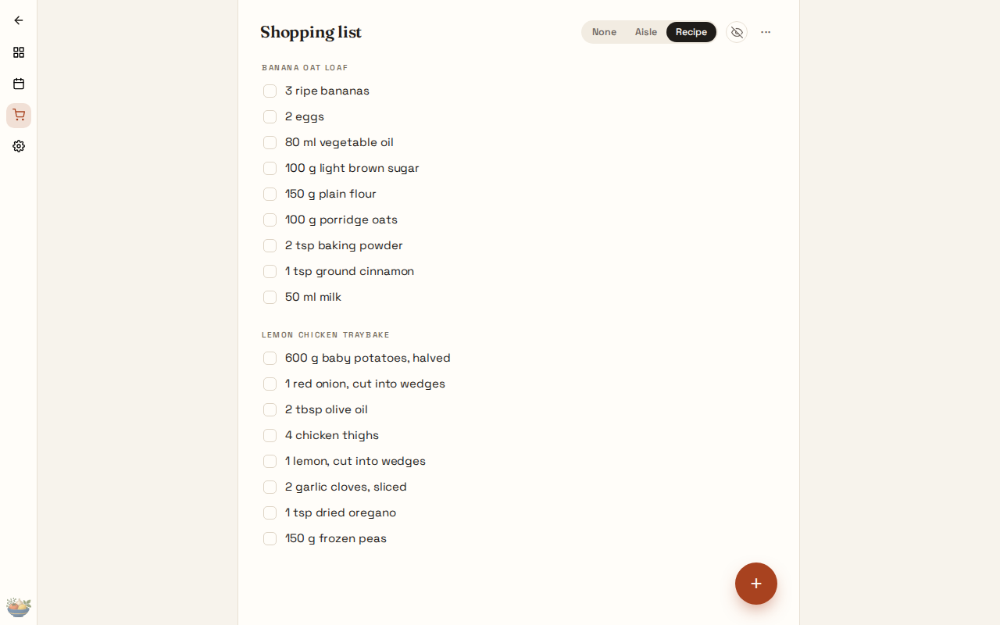

> Published snapshot of a private repository, refreshed at each release. Source commit `d155b2628761`, 2026-09-05.

<p align="center">
  
</p>

# Enplace

Enplace is a local-first meal-planning app for turning the recipes you already own into a practical week. Browse recipes, choose what to cook, plan each day, and build the shopping list. Open the link and your cookbook is there; send the link and your household is in it too.

**[Open Enplace](https://enplace-trial.pages.dev/)**

<p align="center">
  
  
  
</p>

## The weekly loop

1. Browse or filter your recipes.
2. Mark what you want to cook this week.
3. Drag each recipe onto a day in the planner.
4. Build the shopping list and check items off as you shop.

## Your cookbook

Opening Enplace makes a cookbook and gives it a private link. The cookbook lives on your device and works offline. To use it on another device or with a partner, share the link from Settings; everyone on the link sees the same recipes, plan, and shopping list, and ticks made in the shop appear on the other phone within a moment. There is no account and no sign-in: the link is the key, so treat it like one.

## Your files

Everything exports as plain Markdown and images. Download the whole cookbook as a zip from Settings, or import files and zip archives. Transfers are explicit: shared changes never write into a local folder.

## Adding recipes

Paste a recipe as Markdown, import files or a zip from Settings, or let an assistant do the extraction: the `recipe-extraction` skill in this repository produces Enplace Markdown from a link, text, or photo, and `mep add` validates and files it.

## Sharing and sync

Devices encrypt cookbook updates before sending them through the Yjs websocket relay. The private link contains the secret; the relay receives a separately derived room id and ciphertext. The hosted app points at one by default; you can run your own with `node scripts/cookbook-relay.mjs` and set `VITE_ENPLACE_RELAY_URL` when building the app. See [docs/relay.md](docs/relay.md).

## Optional CLI

For terminal or agent-assisted workflows, the optional Node 24 `mep` CLI checks, adds or converts recipes, lists a folder’s recipes, and rebuilds `Shopping.md` for a planned week. Import its files into the PWA deliberately. Build it with `npm run build:cli`; the web app does not require it.

## Development

```bash
git clone https://github.com/joe-butler-23/enplace.git
cd enplace
npm ci # installs the app, CLI, and relay workspace from one lock
npm run build:static
npm run preview
```

Open `http://127.0.0.1:4173/`; a fresh cookbook is created for you. Set `VITE_ENPLACE_RELAY_URL` at build time to sync through a relay.

See [CONTRIBUTING.md](CONTRIBUTING.md) and [AGENTS.md](AGENTS.md) before making changes.

The public repository at [github.com/joe-butler-23/enplace](https://github.com/joe-butler-23/enplace) is a snapshot of this one, refreshed at each release by `scripts/publish-public.sh`.

Enplace is early, actively developed software. Licensed under the [MIT license](LICENSE). Typography is self-hosted Fraunces and Space Grotesk, licensed under the [SIL Open Font License](public/fonts/OFL.txt).

### Recipe files

Enplace writes [RecipeMD](https://recipemd.org/specification.html), so you can give that specification to any recipe assistant and import the resulting `.md` file through Settings → Import files. Source links and covers remain ordinary Markdown in the description. Existing Enplace recipes remain readable during migration.

`mep convert recipe.md` prints a RecipeMD conversion to stdout without altering the original file. Review the result before replacing the original. Conversion preserves existing prose and metadata; it does not infer ingredient densities or convert measurement systems.

Shopping can be grouped by aisle, recipe, or not at all. Assign aisles in the aisle view; assignments sync with the list. Reset shopping list, under More actions, removes every checklist item after confirmation.
